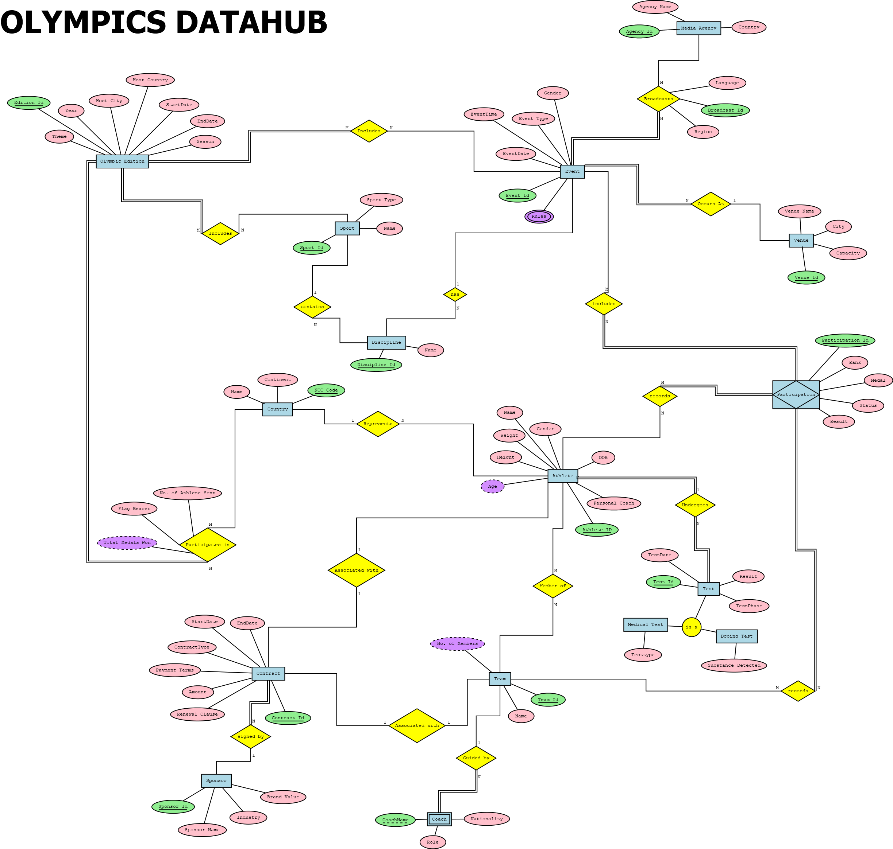
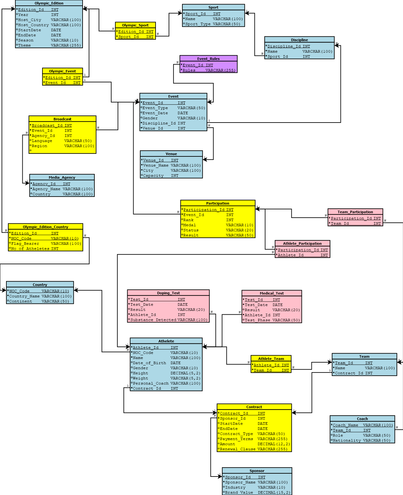

# 🥇 Olympics Datahub

A comprehensive **PostgreSQL-based relational database management system** designed to model and manage Olympic Games data. The project demonstrates core database design principles through **ER modeling, BCNF normalization, relational schema design, and data integrity constraints**.

---

## 📌 Features

- Designed a normalized relational database with **23 interconnected tables**.
- Modeled Olympic editions, athletes, sports, disciplines, events, venues, countries, teams, sponsors, contracts, and media agencies.
- Applied **BCNF normalization** to reduce redundancy and improve data integrity.
- Implemented **Primary Keys**, **Foreign Keys**, and **Many-to-Many relationships**.
- Populated the database with realistic sample data.
- Created **Entity Relationship (ER)** and **Relational Schema** diagrams for database visualization.

---

## 🛠 Tech Stack

- PostgreSQL
- SQL
- Dia
- ER Modeling
- Relational Database Design

---

## 📂 Repository Structure

```
Olympics-Datahub/
│
├── schema/
│   ├── create_tables.sql
│   └── insert_data.sql
│
├── diagrams/
│   ├── ER_Diagram.png
│   └── SCHEMA.png
│
└── README.md
```

---

## 🗂 Database Overview

The database models the Olympic ecosystem through **23 normalized tables**, covering:

- Olympic Editions
- Sports and Disciplines
- Events and Venues
- Athletes and Teams
- Countries
- Participation Records
- Sponsors and Contracts
- Media Agencies and Broadcasts
- Medical and Doping Tests

The schema is designed using **BCNF normalization** to minimize redundancy while maintaining referential integrity through primary and foreign key constraints.

---

## 🖼 Entity Relationship Diagram



---

## 📑 Relational Schema



---

## 🚀 How to Run

### 1. Clone the repository

```bash
git clone https://github.com/ShubhPatel1478/Olympic-Datahub.git
```

### 2. Create a PostgreSQL database

```sql
CREATE DATABASE olympics;
```

### 3. Execute the schema

Run:

```
schema/create_tables.sql
```

### 4. Populate the database

Run:

```
schema/insert_data.sql
```

---

## 🎯 Learning Outcomes

This project strengthened my understanding of:

- Relational Database Design
- Entity-Relationship (ER) Modeling
- BCNF Normalization
- Functional Dependencies
- Database Constraints
- SQL Data Definition Language (DDL)
- SQL Data Manipulation Language (DML)

---

## 👥 Team Members

- **Shubh Patel** *(Group Representative)*
- Yajat Solanki
- Yashrajsinh Solanki
- Yash Oza

---

## 📜 License

This project was developed as part of the **IT214 – Database Management System** course at **Dhirubhai Ambani University** for academic purposes.
